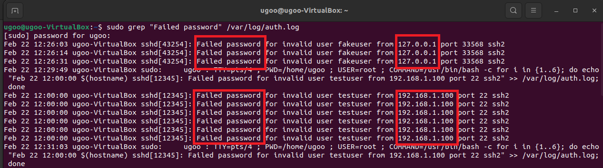
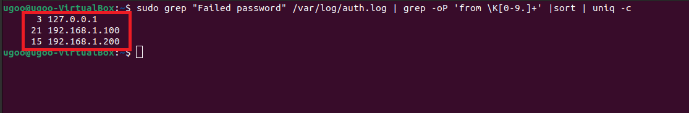
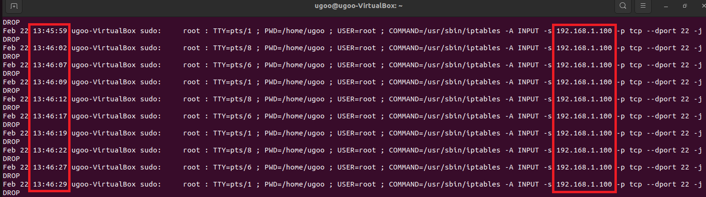
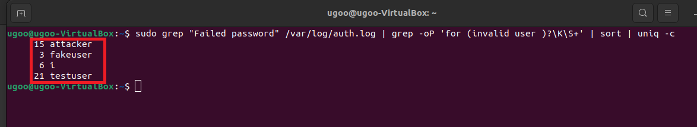
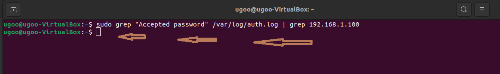
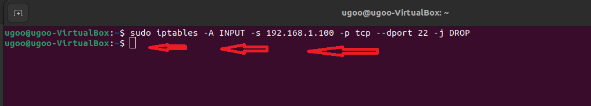
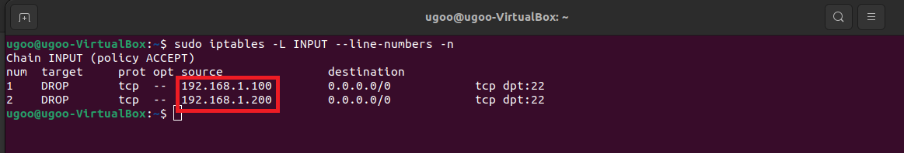

# SSH-Brute-Force-Attack-Investigation-Containment-Lab
ssh-bruteforce-soc-lab/
│
├── README.md
├── commands_used.md
│
└── evidence/
    ├── 01_failed_log_entries.png
    ├── 02_failed_attempts_by_source_ip.png
    ├── 03_attack_timeline_192.168.1.100.png
    ├── 04_failed_login_attempts_by_username.png
    ├── 05_confirmation_of_no_successful_compromise.png
    ├── 06_blocking_highest_attacking_ip.png
    ├── 07_firewall_rules_after_containment.png
    └── 08_persistent_firewall_rules.png

This  project demonstrates a hands-on investigation of SSH brute-force activity on Ubuntu server: 
The objective shows important aspects like:
 • identify suspicious authentication activity
 • Identify the attacking source
 • Analyze attack behavior and timeline 
 • Confirm whether compromise occurred 
 • Contain the threat using firewall rules
 • Implement persistence for production readiness.

#🖥 Lab Environment
	•	Target Machine: Ubuntu VM
	•	Attacker Machine: Kali Linux VM
	•	Monitoring Source: /var/log/auth.log
	•	Firewall Tool: iptables
	•	Network Type: Local VM network
    •   Skill Level: SOC Analyst (ENTRY-LEVEL Simulation)
	•   MITRE ATT&CK: T1110 Brute-force
 ## 🚨 Incident Detection
 # Command used:
  sudo grep "Failed password" /var/log/auth.log
  Observation:
  • Multiple failed login attempts 
  • Multiple username targeted 
  • Multiple source IP addresses observed

  Conclusion:
  Brute-force activity detected).
  

 ## 🌍 Attacker Attribution (Source IP Analysis)
 # Command used:
  sudo grep "Failed password" /var/log/auth.log | grep -oP 'from \K[0-9.]+' | sort | uniq -c 
  Observation:
  • 21 attempts from IP 192.168.1.100 (highest)
  • 15 attempts from IP 192.168.1.200
  
  Conclusion:
  IP 192.168.1.100 is identified as primary attacker
  

 ## ⏱ Attack Timeline Analysis
 # Command used:
  sudo grep "192.168.1.100" /var/log/auth.l
  Observation:
  • Attempts clustered within short time intervals
  • Behavior consistent with automated brute-force script

  Conclusion:
  Attack was automated, not manual.
  

 ## 👤 Username Targeting Analysis
 # Command used:
 sudo grep "Failed password" /var/log/auth.log | grep -oP 'for (invalid user )?\K\S+' | sort | uniq -c
 Observation:
 • Multiple invalid username targeted
 • Indicates credentials enumeration attempt

Conclusion:
 Attacker was attempting username discovery prior to successful authentication.

## 🔍 Impact Assessment
# Command used:
sudo grep "Accepted password" /var/log/auth.log

Observation:
No suucessful authentication from identified attacker IP addresses.

Conclusion:
No confirmed system was compromised.

## 🛑 Block the Highest attacking IP Address
Primary attacking IP "192.168.1.100" was blocked:
# Command used:
sudo iptables -A INPUT -s 192.168.1.100 -p tcp --dport 22 -j DROP

Observation:
Host-based firewall enforcement

## 🚨 Verified Firewall Rule were Applied
# Command used:
sudo iptables -L INPUT --line-numbers -n
Proof of Containment
Observation:
• Implemented host-based firewall rules (iptables)
• Confirmed blocking effectiveness

Conclusion:
✅ Containment successful.

## Persistent Confirmation
# command used:
sudo iptables-save | grep 192.168
Observation:
• Enabled persistent firewall configuration
• identified root cause (exposed passsword authenticationConclusion: 
• Recommended defensive improvements (Key-based authentication)
• IPs appear in saved config

## 📖 Lesson Learned:
Starting from log monitoring and analysis, early detection identified numerous attacks but with the effective activation and automation of firewall,
potential compromise was avoided, layered defensive controls are critical when exposing SSH serrvices.

  
  
